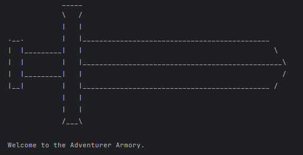

<h1 style="text-align:center">⚔️ Adventurer Armory ⚔️</h1>
<h4 style="text-align:center">Customizable weapon shop written in Java.</h4>


---

<div style="text-align:center;">
</div>

---

## Features
* Creates customized weapons, like Swords, Axes, and Maces based on user input.<br>

* Utilizes a custom InputGetter utility to ensure user input is appropriate for each prompt.<br>

```java
public static int getInt(String prompt) {
    while (true) {
        System.out.print(prompt);
        try {
            return Integer.parseInt(myScanner.nextLine().trim());
        } catch (NumberFormatException e) {
            System.err.println("\nInvalid input. Please only enter the number values you wish to input (ex: 99).\n");
        }
    }
}
```
* Allows choices from multiple Materials and weapon Subtypes.
* Handles purchasing multiple customized weapons at once.
* Optionally can inlay one of various Gemstones into each weapon.<br>

* Structured to scale easily for future additions, such as Bows, Wands, Armor, etc.
* Handles dynamic pricing by storing information read from a pricing catalog file into a HashMap.<br>

* Each object has a getTotalPrice method implemented by the Priceable interface, and reads from the loaded HashMap passed in by the Constructor.<br>

* Easily calculates an Order's total price by summing up their individual values.
```java
public double getOrderPrice() {
    return purchases.stream()
            .mapToDouble(Priceable::getTotalPrice)
            .sum();
}
```
* Creates and stores a receipt after the user decides to check out their order.<br>

* Automatically assigns Order Number based on number of stored receipts.<br>
```java
public int getOrderNumber() {
        File folder = new File(RECEIPTS_FILE_PATH);
        File[] receipts = folder.listFiles(((dir, name) -> name.toLowerCase().endsWith(".csv")));
        return (receipts == null) ? 1 : receipts.length + 1;
    }
```
## TL;DR, how does it work?<br>
1. Prompt user for weapon type and customizations, and creates the corresponding object.
2. Menus loop until appropriate input is given, and the user chooses to exit.
3. Display pricing and add each created weapon object into their order.
4. Calculate total price when requested or upon checking out their order.
5. Writes and stores a receipt for each order, with an accurate order number that scales with each purchase.


